# Car Acceptibility Evaluator

There are various characteristics of a car which affect its acceptibility among its users. Some of these characteristics are: cost of buying and maintaining the car, the safety features, the luggage and boot space and the number of passengers it can carry. When these features are combined and compared, some cars have a better acceptance over others. This project involves training a Machine Learning model which takes different characteristics of a car and predicts it acceptance with the users. Once the model is trained, its hosted as a web-service for consumption.

## Dataset

### Overview

The Car Evaluation dataset has been taken from the UCI Machine Learning Repository. This dataset contains various structural and technical details about cars on the basis of which they are classified into different categories. Some of those details are:
  1. Cost of buying the car (low, med, high, vhigh)
  2. Maintenance of the car (low, med, high, vhigh)
  3. Number of doors present in the car (2,3,4,5more)
  4. Number of passengers the car can accomodate (2, 4, more)
  5. Luggage space in the car (small, med)
  6. Safety of the car (low, med, high)
  7. Acceptibility (unacc, acc, good, vgood)

### Task

The task involves classifying the cars into different acceptibility categories and hence this is a Classification problem. Out of the 7 features of the dataset mentioned above, we use the first 6 features (cost of buying, cost of maintaining, number of doors, number of passengers, luggage space, safety) for training the model while the 7th feature (acceptibility) is used as the target column.

### Access
We access the data directly from the UCI ML Repository using the ```TabularDatasetFactory.from_delimited_files()``` method. The screenshot below demonstrates how this method was used.
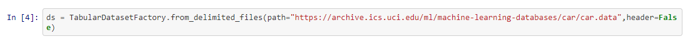

## Automated ML
For the AutoML run, we use the following settings:
1. Experiment Timeout: 30 minutes (since we need to complete this experiment in a limited timeframe).
2. Primary Metric: Accuracy (the metric on the basis of which performance of the models is evaluated).
3. Enable DNN: True (this allows the AutoML run to look for Deep Neural Network models).
4. Enable Early Stopping: True (since we want the training to stop in case the performance of the models starts deteriorating).
5. Enable Voting Ensemble & Enable Stack Ensemble: False (since we dont want AutoML to conduct an ensemble of all the models at the end of the run).

We use the following configurations:
1. Set the compute cluster to ```capston-compute```.
2. Set the task as ```Classification```.
3. Set the value for training dataset.
4. Set the name of the target column (the column which you wish to predict).
5. Pass the AutoML settings parameter.

The above values can be verified in the screenshot below.
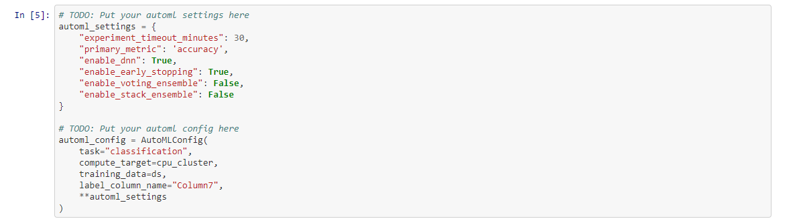

### Results
The different models and their respective accuraces, as generated by the AutoML run, can be seen in the screenshot below.
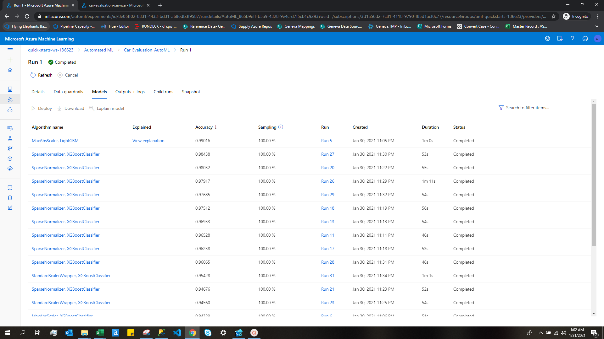

The AutoML run generated MaxAbsScaler LightGBM as the most accurate model with almost ```99.02%``` accuracy. The parameters of the model are as follows:
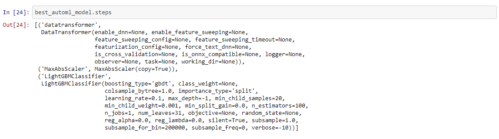

The RunDetails widget was used to keep track of the running application.
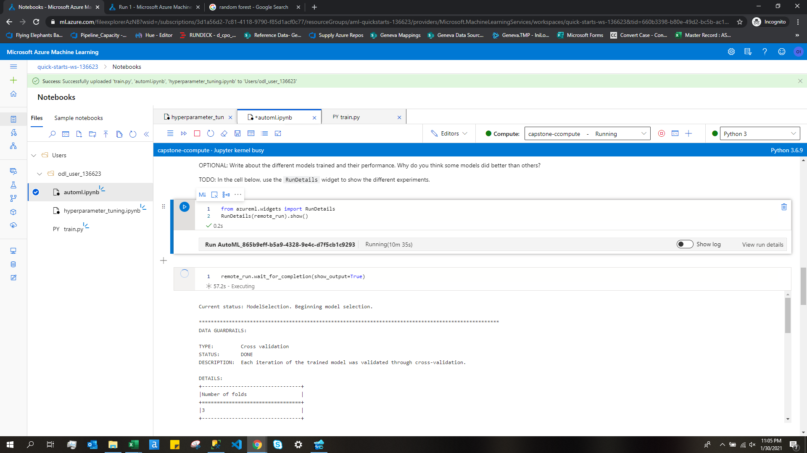

For improving the results, we could try improving on the following points:
1. It was reported that the dataset suffered from the problem of class imbalance. Oversampling and undersampling techniques could be useful in this case.
2. Allowing the model to run for longer duration will give enough time to AutoML to come up with a better model.
3. This dataset contained about 1700 records. We can try increasing the number of training data which will be useful in the case of training Deep Neural Networks.

## Hyperparameter Tuning
We use Random Forests since this is a Classification problem. Random Forests are based on the ensemble learning method and consist of multiple decision tress. Random Forests have been proven to be very effective in Classification and Regression problems.

The early termination policy (Bandit Policy), stops the training process in case the performance of the model starts deteriorating with increasing iteration number. This helps us retain the last best-fitted model and also save the consumption of resources.

In the HyperDrive Configuration, we use the Random Sampler that automates and speeds up the process of trying out different combinations of hyperparameter values in order to obtain the most efficient model. In this case, we have 4 hyperparameters:
  1. Number of Estimators (50,100,150,200,250)
  2. Maximum depth of the Decision trees (10,20,30,40,50)
  3. The criterion used to measure the quality of split (gini,entropy)
  4. Maximum number of features to be considered while making a split (5,10,15)

The primary metric used to determine is performance of the model is Accuracy. While accuracy is a very standard metric, we could have used other metrics like AUC Score. In order to limit the consumption of resources, we limit the maximum run to 20 iterations and maximum concurrent runs to 5. These values can be further increased based on the availability of the required reosurces.

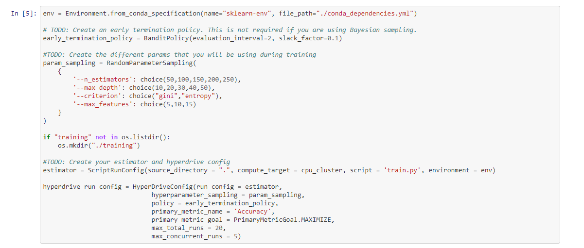

### Results
HyperDrive tried different combinations of hyperparameters to derive the following models:
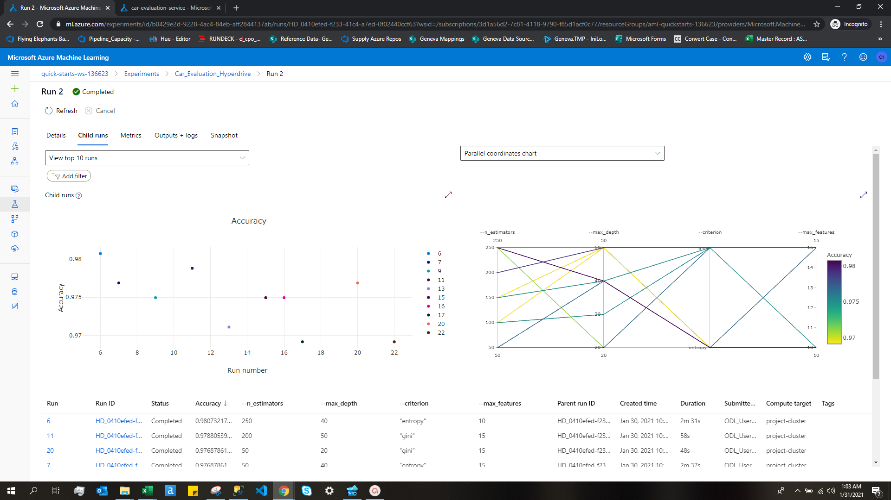

The runId and the values of hyperparamers for the best produced model is as follows:
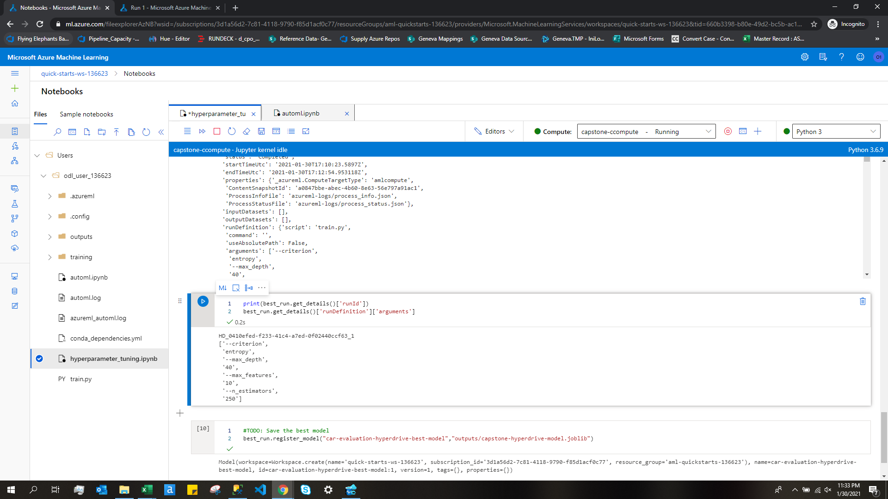

The details of the run can be observed in near-realtime using the RunDetails widget as shown below.
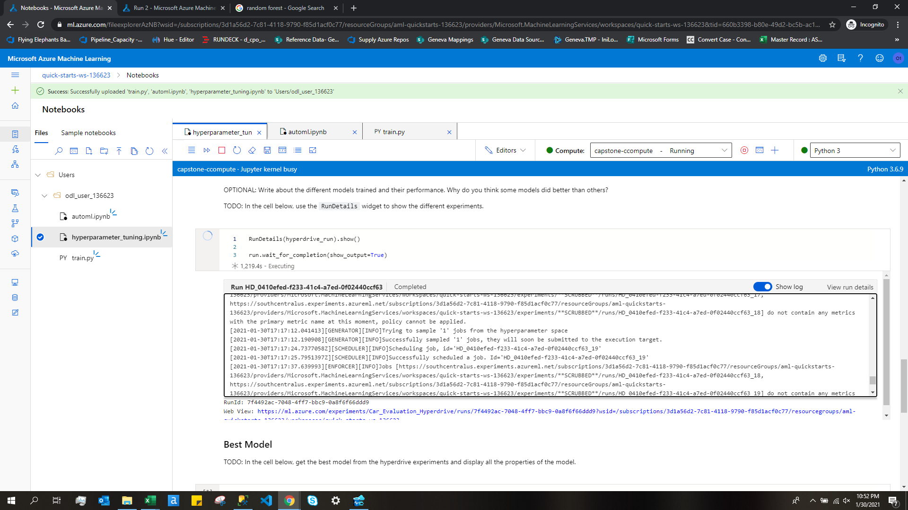

To improve the performance of the model we could have performed the following steps:
  1. Try a different and more complex algorithms like Deep Neural Networks.
  2. Collect more training data.
  3. Resolve the class imbalance problem using techniques like Oversampling and Undersampling.
  4. Try a wider range of hyperparameters.
  5. Let the HyperDrive run for a longer duration of time instead of limiting it for only 20 iterations.

## Model Deployment

Since the AutoML run produced a more accurate model (99.02% accurate MaxAbsScaler LightGBM) than the HyperDrive-optimized Random Forests classifier (98% accurate), we deploy the model generated by the AutoML run. To deploy the AutoML model, we use the ```Model.deploy()``` method in the following way:
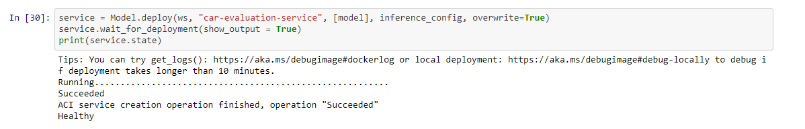

Once the model has been deployed, the same can be confirmed from the Endpoints UI screen which shows the ```Status``` of the deployed model as ```Healthy``` which simply means that the model has been deployed successfully and is ready to serve prediction requests.
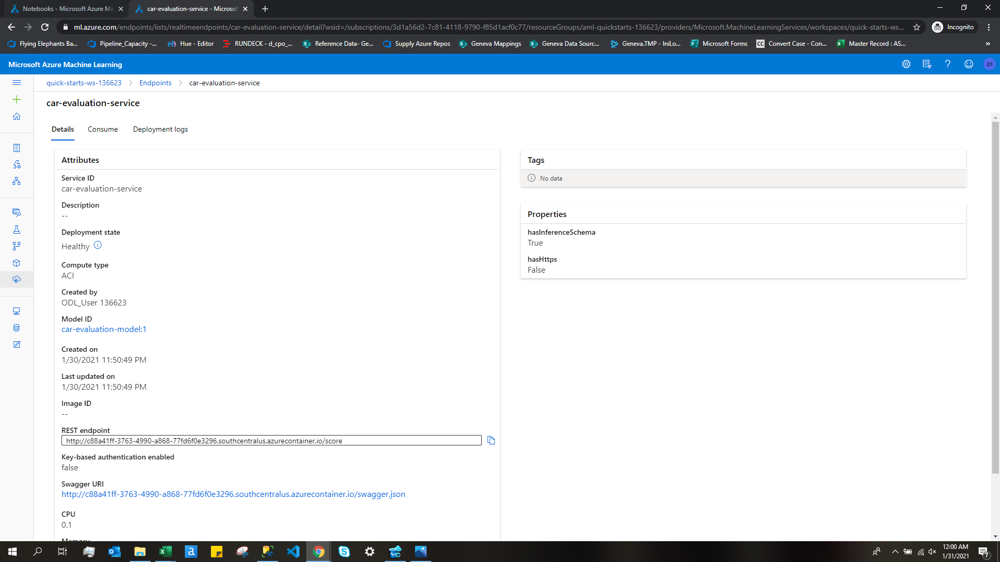

We can test the deployed model in two ways:
  1. By sending the data via an HTTP request
  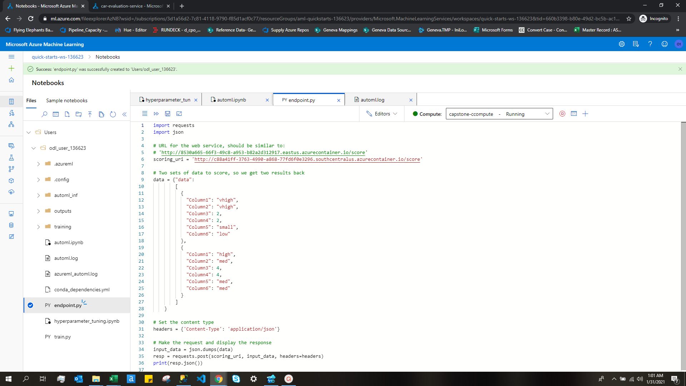
  
  2. By using the ```service.run()``` method
  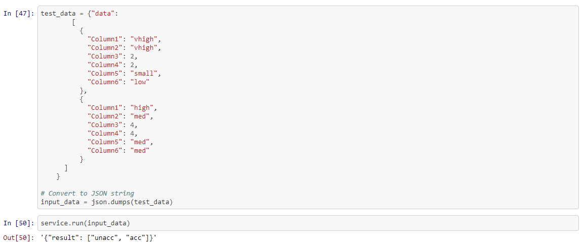
  
Once the deployed model is tested, we print the logs and then delete the deployed service.
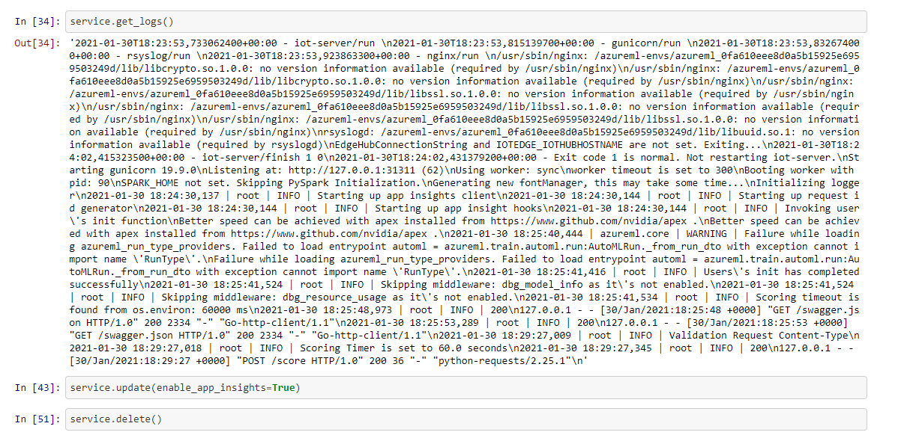


## Screen Recording
The screencast of the project can be accessed using the link: https://youtu.be/SD7OUOWWGHA
<br>It covers the following points:
- A working model
- Demo of the deployed  model
- Demo of a sample request sent to the endpoint and its response

## Standout Suggestions
One of the standout suggestions was to enable logging in the deployed model. This was achieved by simply adding the following line of code:
```
service.update(enable_app_insights=True)
```
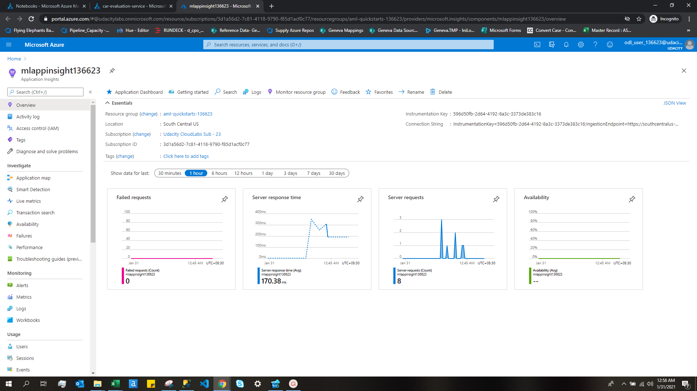
